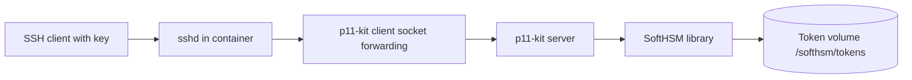

# SoftHSM Container Architecture

This container provides a software HSM endpoint for local development and test
environments. It combines three responsibilities in one image:

- Initializes and stores SoftHSM tokens on a persistent volume.
- Exposes the PKCS#11 provider through `p11-kit server` on a Unix socket.
- Accepts SSH key-based access so the socket can be forwarded securely.

## Runtime Flow



## Container Responsibilities

### 1. SoftHSM initialization

The entrypoint creates `/etc/softhsm2.conf`, checks whether the configured
token label already exists, and initializes the token if needed.

### 2. PKCS#11 remoting

`p11-kit server` runs in the foreground and publishes the SoftHSM provider on
`unix:path=/run/p11-kit/pkcs11`.

### 3. SSH access

`sshd` is started in the container so clients can authenticate with an SSH key.
The public key is supplied through `SSH_AUTHORIZED_KEYS` and written to
`/root/.ssh/authorized_keys`.

## Important Environment Variables

- `LABEL`: SoftHSM token label.
- `PIN`: user PIN for the token.
- `SO_PIN`: security officer PIN for the token.
- `SSH_AUTHORIZED_KEYS`: optional OpenSSH public key string for root login.

## Volumes And Paths

- `/softhsm/tokens`: persistent SoftHSM token storage.
- `/run/p11-kit/pkcs11`: Unix socket exposed by `p11-kit server`.
- `/var/run/sshd`: runtime directory for the SSH daemon.

## Client Side

A remote client should use `p11-kit-client.so` and point it at the forwarded
socket via `P11_KIT_SERVER_ADDRESS`, for example:

```bash
export P11_KIT_SERVER_ADDRESS=unix:path=/run/p11-kit/pkcs11
```

If the client is forwarding the socket over SSH, the SSH key authenticates the
transport and the token PIN still authenticates access to the SoftHSM token.
